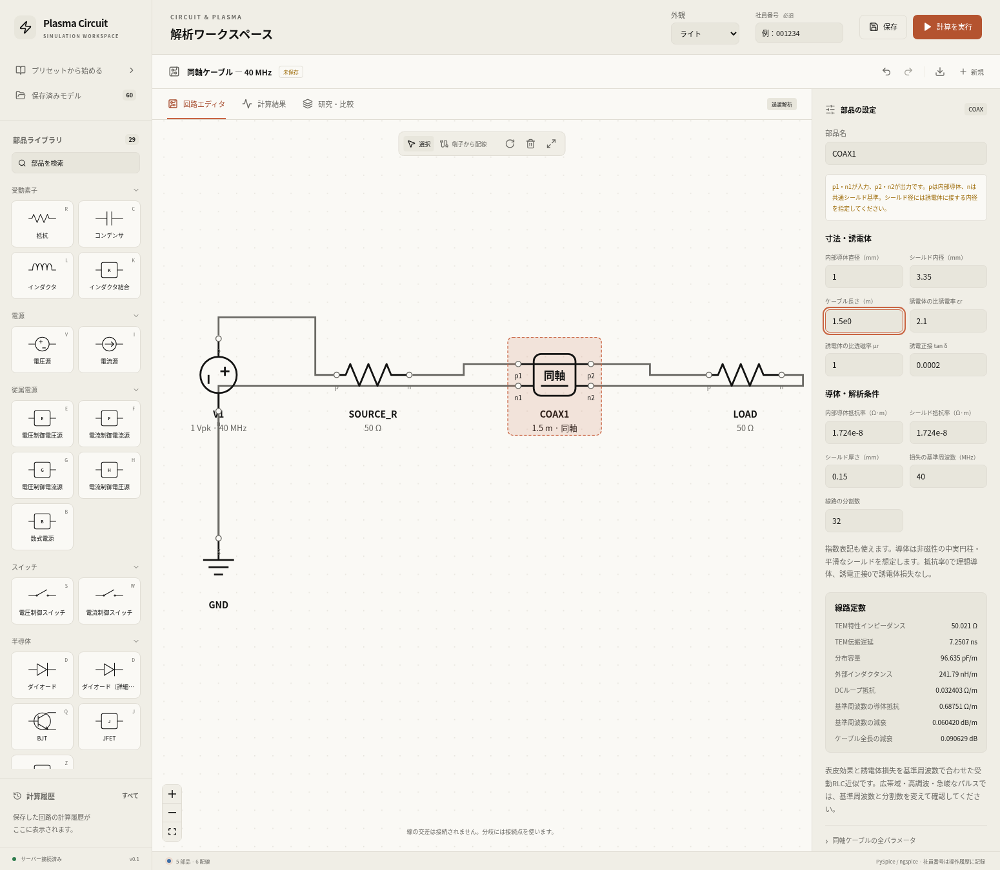
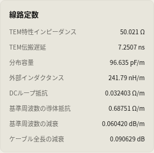
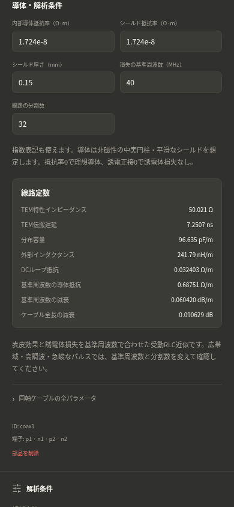
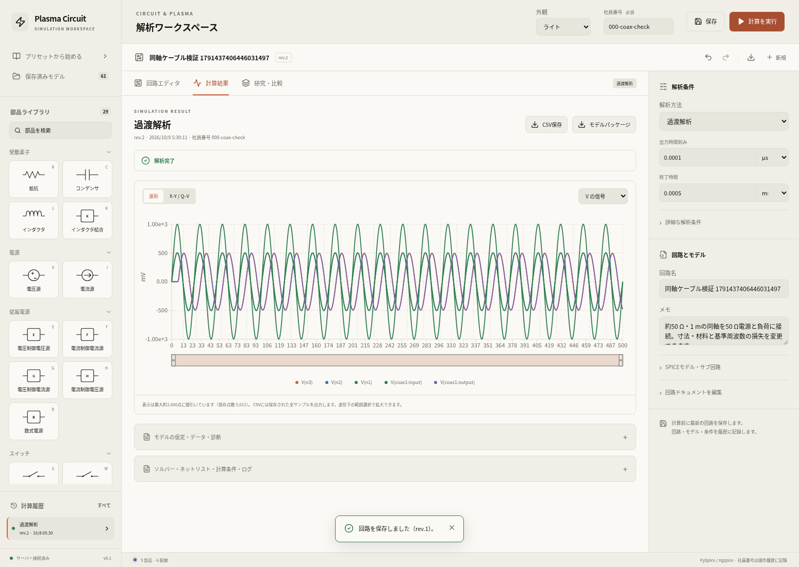

# 同軸ケーブルの実装・確認結果

確認日：2026-10-08。伝送線パレットに4端子の `COAX` を追加した。内部導体径、シールド内径、長さ、誘電体εr/μr/tan δ、内部・シールド導体の抵抗率、シールド厚さ、損失の基準周波数、分割数を入力できる。指数入力、線路定数プレビュー、保存・再読込、研究軸、端子電圧・電流・正味入力電力に対応した。使い方・モデル式・範囲は[仕様](../../docs/coax-cable.md)を参照。

## 計算とAPI

Docker内の最終バックエンドで関連6ファイルのテスト **211 passed、失敗0、66.98秒、終了コード0**。[実出力](backend-tests.txt)を保存した。警告1件は既存のStarlette/anyioの非推奨APIである。

```bash
docker compose -f compose.yaml -f compose.cloud.yaml run --rm --no-deps api \
  timeout 180 python -m pytest tests/test_coax.py tests/test_engine.py \
  tests/test_api.py tests/test_workflows.py tests/test_external_rf.py \
  tests/test_model_deletion.py -q --tb=short
```

同軸の28ケースは、独立TEM式とεr/μrのスケーリング、円柱Bessel解と高周波表面インピーダンス、16種の不正入力、書込をしないプレビュー、シールド基準とDC導通、512区間の上限、初期条件、研究軸を確認した。実PySpice/ngspiceで、負荷不整合を含む無損失・誘電体損失付き線路のAC複素応答（64分割、理論との相対誤差基準2×10⁻⁴）、真のDC抵抗と誘電体のDC漏れなし、整合したパルスの伝搬遅延（理論との許容差0.12 ns）を確認した。

同じ実ソルバーでプリセットの過渡解析と、0.5 mの線路を入れた外部CCPの2構成を確認した。DCブロックの有無でDC平衡の判定が変わり、双方で数値収束した。CCP出力の端子信号・周期平均正味入力電力・線路定数を記録し、軸と信号の配列長、有限JSONを検証した。密度・温度を指定するCCP回路の確認であり、同軸付きグローバル化学モデルの実験検証ではない。

## 実ジョブと独立比較

ブラウザとAPIからPostgreSQL/RQへ実ジョブを投入し、DockerのPySpice 1.5 / ngspice 39で4件とも `succeeded`・`converged=true` を確認した。レスポンス、キュー、ソルバー結果はモックしていない。1.5 mの過渡解析、同じモデルのAC解析、0.5/1.5 mの過渡スタディ2ケースである。run ID・ソルバー版・実装ハッシュ・線路定数・研究座標は[確認記録](verification.json)に保存した。

ACジョブの40 MHzの点を、アプリの `Coax` を使わずに計算した分布定数ABCD式と比較した。内部導体の円柱Bessel解とDC断面積を保つシールド表皮近似からZ′を求め、`Y′=ωC′(tan δ+j)`、`γ=√(Z′Y′)`、`Zc=√(Z′/Y′)` を使用した。

```text
A = D = cosh(γℓ)
B = Zc sinh(γℓ)
C = sinh(γℓ)/Zc
Vout / Vsource = 1 / [A + B/Rload + Rsource(C + D/Rload)]
Pnet = ½ Re(Vin Iin* − Vout Iload*)
```

条件は1 Vピーク、電源抵抗・負荷50 Ω、長さ1.5 m、32分割、材料は初期値。比較値は[独立比較のJSON](reference-comparison.json)に残した。

| 指標 | 分布定数理論 | 実ジョブ |
| --- | --- | --- |
| 出力ピーク電圧 | 0.494812676 V | 0.494809681 V |
| 出力位相 | −104.994132° | −105.008327° |
| 正味入力電力 | 51.452052 μW | 51.469910 μW |
| 複素電圧の相対誤差 | 許容0.05% | 0.024782% |
| 正味入力電力の相対誤差 | 許容0.05% | 0.034708% |

初期値のTEM特性インピーダンスは50.021085 Ω、伝搬遅延4.833803 ns/m、40 MHzでの減衰0.0604195 dB/m。TEM遅延は外部L′/C′から求める値で、実位相には内部インダクタンスも含まれる。

## ブラウザ

[check_coax_ui.py](../../scripts/check_coax_ui.py)で **8チェック合格、runtime error 0**。確認内容は次のとおり。

- 配線済みプリセット・4端子・初期線路定数。プレビューでモデルやジョブを作成しない。
- 全11項目の指数入力、mm/MHz→SI変換、長さ変更に応じた定数表示。不正な径、非整数分割数、不完全な指数では保存要求を出さない。
- 390/320 pxのダーク画面で入力と定数を操作でき、ページ横はみ出しがない。
- 保存・UIからの実過渡計算・端子波形・電力・CSV・パッケージと実装ハッシュ。
- 実APIで追加したACジョブの振幅・位相・平均電力。
- 全11項目の研究セレクターと、UIから作成した長さ2ケースの実ジョブ。
- 一覧ページからモデルを開き、入力単位・線路定数を再表示。
- 検証用モデルだけを論理削除。既存の有効モデル60件の一覧メタデータは前後で一致し、検証結果の履歴も取得できる。

```bash
python scripts/check_coax_ui.py --base-url http://localhost:8080
```

再実行にはPlaywrightとChromiumが必要。検証用モデル1件を作成し、終了時にはそのモデルだけを一覧から削除する。ジョブ・研究履歴は保持する。









入力・定数画像は確認後に保存・計算を伴わないプリセット表示で撮り直し、プレビュー完了後を記録した。結果画像は実ブラウザ受入確認の過渡ジョブ。画像条件と最終配備イメージは[確認記録](verification.json)と[配備イメージ](deployment.jsonl)に残す。

## 適用範囲

均一なTEM線路、非磁性の中実内部導体・平滑シールド、共通の理想シールド基準を仮定する。シールド表皮効果は平板近似で、編組・撚線・めっき・粗さ・外部コモンモードは対象外。

導体の表皮効果と誘電体損失は基準周波数の複素Z′/Y′に一致する受動RLC近似。広帯域の材料分散を厳密に表すものではない。今回の独立比較は基準周波数の回路モデルと離散化誤差の確認であり、実測ケーブルやプラズマの実験validationではない。

Dockerのビルド時に容量不足が発生したが、未使用ビルドキャッシュ・参照されていないイメージを整理して解消した。PostgreSQL/Redisのボリュームを保持したままAPI・worker・frontendを更新し、最終healthは `ok`。
