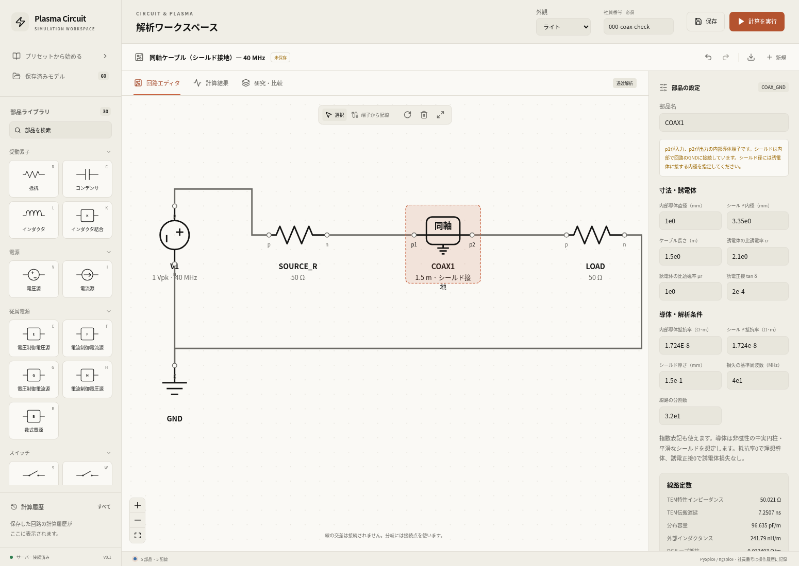
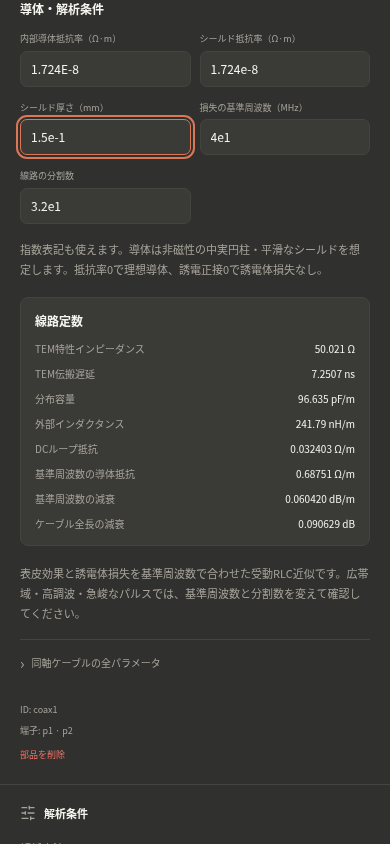
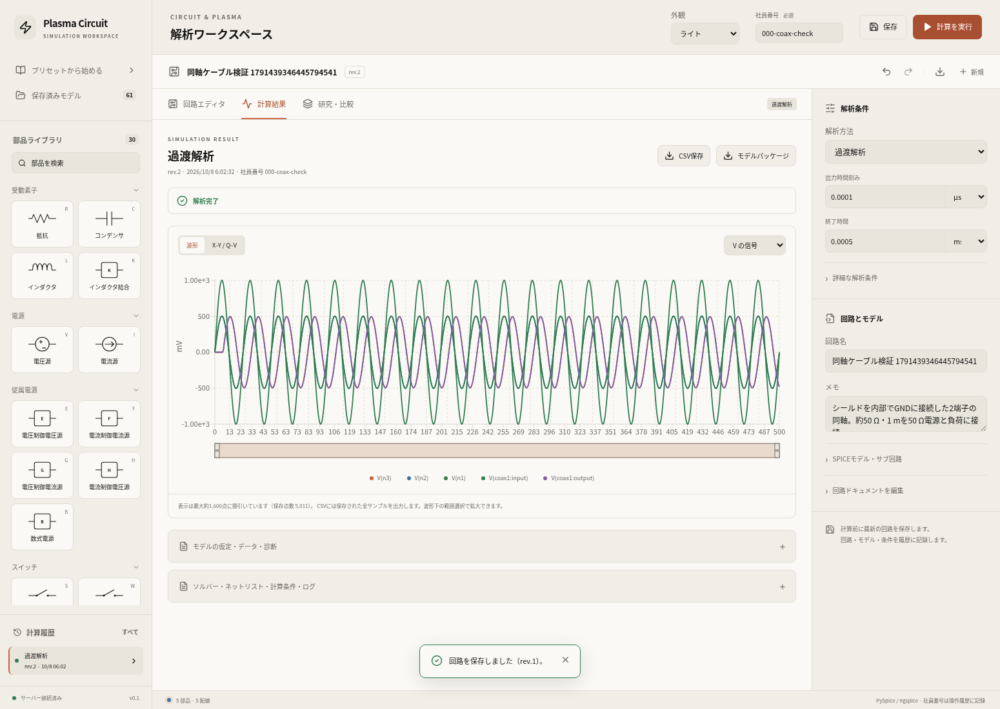

# シールド接地の同軸ケーブル

確認日：2026-10-08。従来の4端子 `COAX` を保持し、シールドを内部でGNDに接続する `COAX_GND` を追加した。パレット名は「同軸ケーブル（シールド接地）」、表示する端子は入力 `p1`・出力 `p2` の2個。接地記号とシールド接地の説明を表示する。寸法・材料・損失モデル・研究項目は共通で、既存保存モデルの変換やDB移行は行わない。[設定・配線の説明](../../docs/coax-cable.md)を参照。

## 計算確認

最終Dockerイメージで関連6ファイルの **223テスト合格、失敗0、116.95秒、終了コード0**。[出力](backend-tests.txt)を保存した。Starlette/anyioの既存の非推奨警告1件。TypeScript検査とVite本番ビルドも成功した。

```bash
docker compose -f compose.yaml -f compose.cloud.yaml run --rm --no-deps api \
  timeout 180 python -m pytest tests/test_coax.py tests/test_engine.py \
  tests/test_api.py tests/test_workflows.py tests/test_external_rf.py \
  tests/test_model_deletion.py -q --tb=short
```

- シールド接地版の電気端子は `[node(p1), 0, node(p2), 0]`。回路ドキュメントとノードマップに隠れた `n1/n2` は追加しない。
- 実PySpice/ngspiceで4端子版を接地した回路と比較し、DC動作点・DCスイープ・AC・過渡解析の端子電圧・電流・正味入力電力が一致することを確認。比較の許容差は相対1×10⁻¹⁰／絶対1×10⁻¹²。
- 両素子で無損失・誘電体損失ありの分布定数ABCDとのAC比較、真のDC抵抗と誘電体のDC漏れなし、整合パルスのTEM遅延を確認。
- 両素子の外部CCPを、DCブロックあり／なしの4構成で実計算し、数値収束・DC平衡の判定・端子信号と周期平均正味入力電力を確認。接地シールドを内部導体のDC接地として扱わない。
- 両種類を混在させても分割数の合計上限512を適用。不正な2端子定義や隠れたシールド端子への配線を拒否。研究軸と初期条件も確認。

同軸の関連テストは40ケース、その他の回路・API・研究・外部RF・モデル削除の回帰は183ケース。損失の基準周波数近似とTEMモデルの適用範囲は従来どおりで、プラズマの実験validationの追加ではない。

## 実ブラウザと保存

[確認記録](verification.json)は **8チェック合格、runtime error 0**。API・キュー・ソルバーをモックせずに確認した。

- パレットに両種類があり、接地版のプリセットに `p1/p2` だけを表示。線路定数プレビューでDBやキューへ書き込まない。
- 共通の11項目を指数表記で入力し、径・分割数・不完全指数の不正入力を拒否。
- 390/320 pxのダーク画面で操作可能、ページの横はみ出しなし。
- PostgreSQLへ部品種別・2端子・材料値を保存し、実UIから過渡計算を実行。CSV・解析パッケージを取得。
- 実APIでAC計算を追加。長さ0.5/1.5 mの2ケース研究をUIから実行。
- 全4ジョブが `succeeded`・`converged=true`。ソルバーはPySpice 1.5 / ngspice 39。各結果の `component_kind=COAX_GND`、`shield_reference_node="0"` と実装ハッシュを確認。
- 一覧ページから再読込し、2端子とSI換算・材料値・線路定数を復元。
- 検証用モデル1件だけを論理削除。既存の有効モデル60件の一覧メタデータは前後で一致し、計算・研究履歴は保持。

今回ダウンロードした過渡解析CSVは、前回の4端子・接地シールド回路の[CSV](../coax-cable/transient.csv)と全1,486,518 bytesで一致した。SHA-256は `6e7a50682d53216ec8b0e4fbfe1891f15c11ed96c50da538387e093d1118960f`。波形データは既存ファイルを共用し、接地版のrun ID・部品種別・条件・実装ハッシュは今回の確認記録に別途保持する。

```bash
python scripts/check_coax_ui.py --variant grounded --output reports/coax-grounded
```

再実行にはPlaywrightとChromiumが必要。検証用モデル1件と実ジョブ4件を作り、成功時にそのモデルだけを一覧から削除する。`--variant explicit` で従来の4端子版も確認できる。配備イメージは[記録](deployment.jsonl)を参照。API・worker・frontendの更新時にPostgreSQL/Redisボリュームを保持した。






