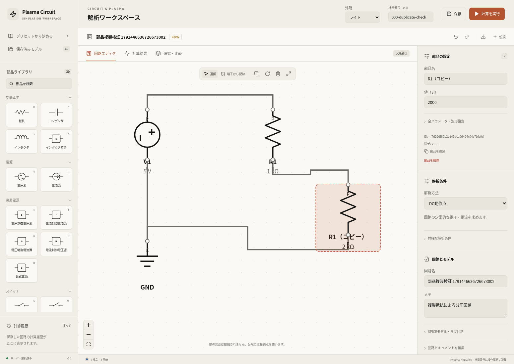
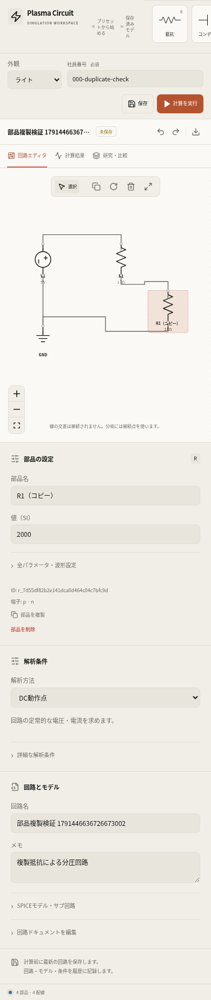

# 配置済み素子の複製：検証結果

確認日：2026-10-08。設定欄の「部品を複製」、回路上部の複製ボタン、`Ctrl+D`／`⌘D`で、選択した素子の内部設定・端子・回転角をコピーする機能を追加した。

複製には新しいIDと重複しない部品名を与え、近くの空いている位置へ配置する。複製した素子を自動で選択し、個別に編集できる。配線は追加しない。参照する電圧源・インダクタ・SPICEモデル名はそのまま引き継ぎ、文書全体のモデル定義は共有する。EDD枝やJSONの編集は「適用」後の内容をコピーする。

## 確認した結果

Dockerでのフロントエンド本番ビルド（TypeScript型検査とViteビルド）、実ブラウザの6チェックが合格した。API応答・計算結果のモックは使用していない。[機械可読の証跡](verification.json)にソースハッシュ、配備資産、対象種別、実ジョブIDと結果を記録した。

| 確認対象 | 結果 |
| --- | --- |
| カタログ全30種別 | 設定・端子・回転角が一致し、元の素子を保持。端子なしの相互結合、接地、接続点、従属電源、モデル参照、EDD、PLASMA、両同軸ケーブルを含む |
| 内部設定の個別編集 | 電圧源のパルス周期、詳細ダイオードのIS、EDDの複数枝、両同軸ケーブルの長さ、PLASMAのガスを複製側で編集し、元の設定が不変 |
| 操作と入力保護 | 両ボタン、Ctrl+D／Cmd+D、重複しないID・部品名、1操作での取り消しと同じデータの再実行。不完全な指数入力を保持し、入力欄・ダイアログ・結果画面ではショートカットによる複製を行わない |
| 上限 | 100文字のUnicode部品名を複製しても文字数上限・一意性を維持。500部品では両ボタンを無効化し、ショートカットも追加を拒否 |
| 画面 | デスクトップと幅390pxで複製・取り消しを確認。ページ全体の横方向のはみ出しなし |
| 保存と実計算 | 元の1kΩ抵抗から複製した抵抗を2kΩへ変更して配線し、5Vの分圧回路を実ngspiceで計算。出力3.333333333333333Vで理論値10/3Vと一致。別々の素子IDとネットリスト、実行スナップショット、モデル再読込の値と配線を確認 |
| 既存データと実行エラー | 既存の保存モデル60件のメタデータは不変。検証用モデルだけを論理削除し、実計算の履歴は保持。ブラウザの実行時エラー0 |

今回の変更はフロントエンドの編集操作であり、ソルバー・DBスキーマの変更はない。バックエンドの全テストやプラズマの物理バリデーションは今回再実行していない。今回の実ジョブは通常回路のDC動作点である。

## 再実行

起動中のアプリ、PlaywrightとChromiumが必要。検証用モデル1件と実ジョブ1件を作成し、成功後にそのモデルだけを論理削除する。

```bash
python scripts/check_component_duplication.py --base-url http://localhost:8080
```

フロントエンドのビルド：

```bash
docker compose -f compose.yaml -f compose.cloud.yaml build frontend
```

配備済みフロントエンドイメージ：`sha256:b3d1e7894a30d7ccb2ef97fa644292c295a877b90a9a1e9fab67852b5fd66606`。

## 画面




