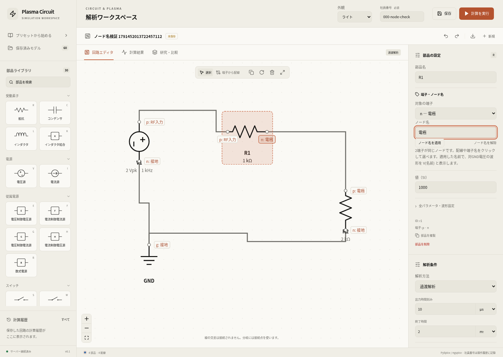
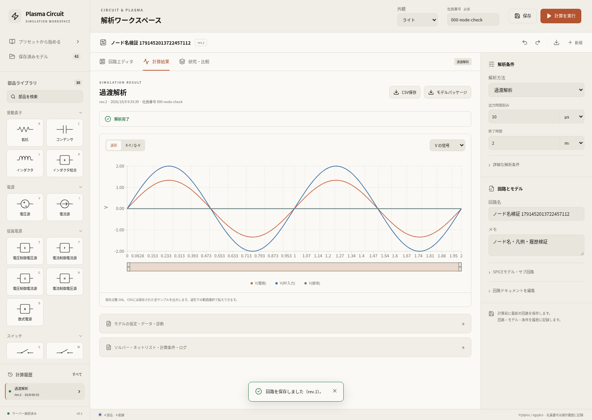
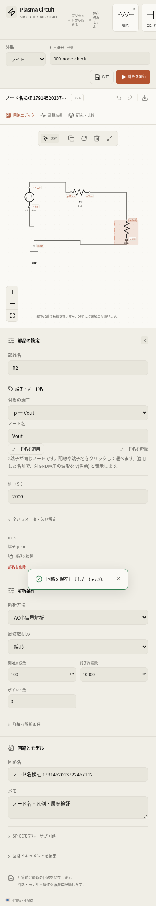

# ノード名・波形凡例の検証

確認日：2026-10-08。端子名または配線を選択し、「端子・ノード名」から名前を適用できるようにした。接続した端子は同じ名前を表示し、結果の凡例・ツールチップ・X–Yプロット・CSV・研究比較では `V(電極)` などを使用する。操作・制限は[ノード名の説明](../../docs/node-labels.md)を参照。

名前は回路の版・実行スナップショット・結果に保存する。過去の結果は計算時の名前を保持する。SPICEのネット名と信号IDは維持し、通常回路では名前の有無によるネットリスト・数値波形の一致を確認した。名前付きの接地には0V波形を追加する。外部CCPでは指定したノードの対GND電圧を実ソルバーから追加し、従来の差動電圧信号も保持する。

## 結果

| 対象 | 結果 | 確認範囲 |
| --- | --- | --- |
| Dockerバックエンド関連7ファイル | 254 passed、警告1、117.94 s、終了コード0 | 新規31ケースを含む。入力検証、電気的ノードの共有、通常回路4解析の数値不変性、外部CCPの実計算、保存・履歴・CSV、同軸・研究・削除の関連回帰 |
| フロントエンド | TypeScript検査・Vite本番ビルド成功 | 配備した資産はブラウザ検証のmanifestに記録。既存のchunk-size advisoryあり |
| ノード名の実ブラウザ受入確認 | 8チェック合格、実ジョブ2件成功、runtime error 0 | 端子・配線選択、共有・改名・解除・undo/redo、重複名の拒否、実際の配線操作、過渡/ACの凡例、ツールチップ、X–Y、CSV、保存再読込、過去の名前、390pxモバイル |
| 素子複製の実ブラウザ回帰 | 6チェック合格、実ジョブ1件成功、runtime error 0 | カタログ全30種別、設定の独立性、ショートカット、入力・上限保護、undo/redo、保存再読込、390pxモバイル |
| 同軸の実ブラウザ確認 | 2チェック合格、runtime error 0 | 4端子版の共通シールド名と2端子版の独立した内部導体名。保存・計算要求なし |

過渡解析では実ngspiceの分圧比2/3と接地0Vを確認した。AC解析では振幅と位相の両方に名前を表示した。改名後の保存・同じモデルの再読込でも、過去の過渡解析は当時の名前を保持する。素子複製の回帰計算は5V・1kΩ・2kΩの分圧電圧3.333333333Vと一致した。全ブラウザ確認でAPI・ソルバー結果のモックは使用していない。

同じ保存モデルを再び開いた際に履歴一覧が戻らない既存の問題も修正し、改名後の履歴再表示で確認した。既存の保存モデル60件のメタデータは確認前後で不変だった。検証用モデルだけを論理削除し、その計算履歴は保持した。

バックエンドでは関連7ファイルを実行した。全バックエンドテストやプラズマの実験バリデーションを追加実行したものではない。APIの単体テストではキューをモックするケースがあるが、ブラウザの3ジョブと数値テストは実PySpice/ngspiceで計算した。

## 証跡・再実行

- [バックエンド出力](backend-tests.txt)
- [ノード名のmanifest](verification.json)：8チェック、実ジョブID、配備資産、対象ソースのSHA-256
- [素子複製の回帰manifest](duplication-regression/verification.json)：6チェック・30種別・実計算結果
- [同軸端子の確認](coax-ports.json)

```bash
docker compose -f compose.yaml -f compose.cloud.yaml run --rm --no-deps api timeout 240 python -m pytest tests/test_node_labels.py tests/test_engine.py tests/test_api.py tests/test_external_rf.py tests/test_coax.py tests/test_workflows.py tests/test_model_deletion.py -q --tb=short
python scripts/check_node_labels.py
python scripts/check_component_duplication.py --output reports/node-labels/duplication-regression
```

ブラウザ確認は起動中のアプリに対して実行する。PlaywrightとChromiumが必要。基準URLは `http://localhost:8080`。DockerのPySpiceは1.5、ngspiceは39。Starletteのanyioに関する既存の非推奨警告1件がある。

配備イメージ：

- API・worker：`sha256:4f24f430281ee933cefa9d7a61bfab9b4862e2a88af1525c2da013634f61cf14`
- frontend：`sha256:e7d1b660fb7900af49e3636e3534c112d18e57fba25c5c912b7180d1f8ae69d5`
- JavaScript：`/assets/index-BI_HBnCK.js`、CSS：`/assets/index-BEgMe0R6.css`






